# Project Documentation

## Introduction

This document provides an overview of the Hero Tracker PWA project. The goal of this project is to create a Progressive Web App with a vintage comic book aesthetic.

## Project Structure

Below is a visual representation of the project structure.

## Key Files

*   `index.html`: The main entry point of the application. It contains the HTML structure and the Vue.js application.
*   `css/`: This directory contains all the stylesheets for the application.
    *   `variables.css`: Defines the color palette and other CSS variables.
    *   `base.css`: Contains the basic styles and resets.
    *   `comic-theme.css`: Implements the comic book aesthetic.
    *   `mobile.css`: Contains the styles for mobile devices.
    *   `desktop.css`: Contains the styles for desktop devices.
*   `js/`: This directory contains the JavaScript files.
    *   `storage.js`: Provides utilities for `localStorage`.
    *   `pwa.js`: Manages the PWA features.
*   `assets/`: This directory contains the static assets.
    *   `icons/`: Contains the application icons.
    *   `textures/`: Contains the textures for the vintage paper background.
*   `README.md`: Provides an overview of the project and instructions on how to set it up.
*   `manifest.json`: The PWA manifest file.
*   `sw.js`: The service worker file.

## "Abilities" Page

The "Abilities" page allows users to manage their character's abilities. The page displays a list of abilities, and users can add, edit, or delete abilities. The availability of each ability is determined by the GYRO (Green, Yellow, Red, Out) system, which is based on the character's current health.

### GYRO System

- **Green:** Only Green abilities are available.
- **Yellow:** Green and Yellow abilities are available.
- **Red:** Green, Yellow, and Red abilities are available.
- **Out:** No abilities are available.

## "Powers/Qualities" Page

The "Powers/Qualities" page allows users to manage their character's Powers and Qualities, which are used as dice in skill checks and actions.

- **Powers:** Supernatural or extraordinary capabilities (e.g., Flight, Lightning Bolt).
- **Qualities:** Skills, traits, or background elements (e.g., Banter, Leadership).
- **Features:**
    - Separate tabs for Powers and Qualities.
    - Add, Edit, and Delete functionality.
    - Each item has a Name and a Die rating (d4-d12).
